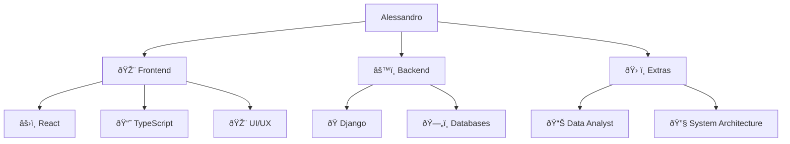

 

  

###

# ✨ HOLA 👋 ✨

###

###

<h1 align="center">Github Metrics </h1>

###

<h3 align="left">About Me</h3>

###

```mermaid
graph TD;
    A[Alessandro] --> B[🎨 Frontend]
    A --> C[âš™ï¸ Backend]
    A --> D[ðŸ› ï¸ Extras]

    B --> E[âš›ï¸ React]
    B --> F[📘 TypeScript]
    B --> G[🎨 UI/UX]

    C --> H[ðŸ Django]
    C --> I[ðŸ—„ï¸ Databases]

    D --> J[📊 Data Analyst]
    D --> K[🔧 System Architecture]
```

  

